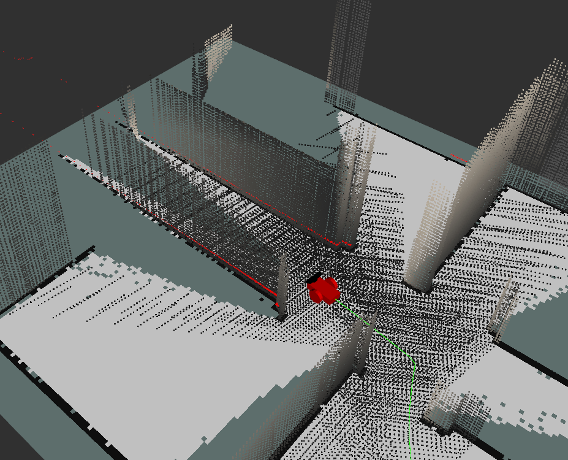
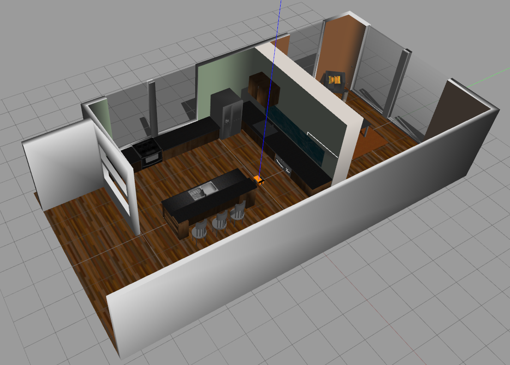
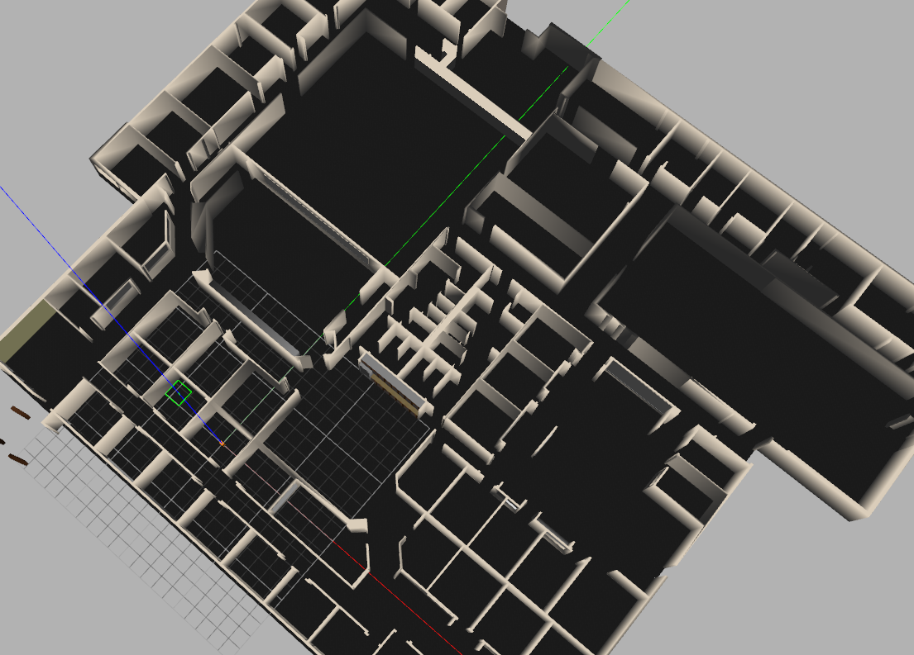
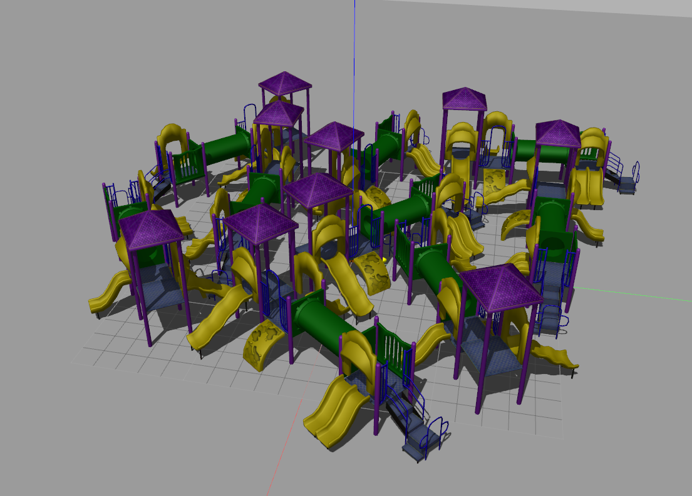
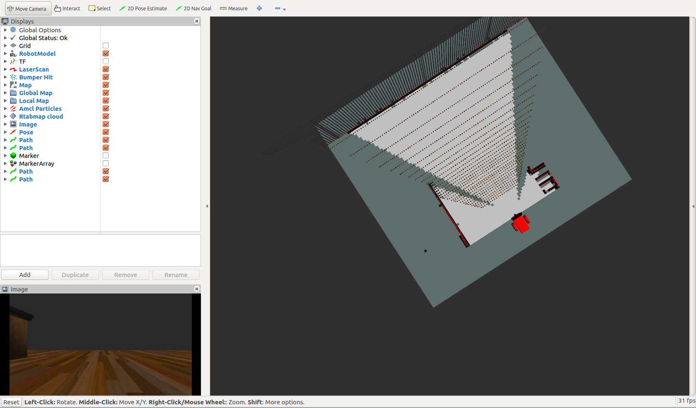
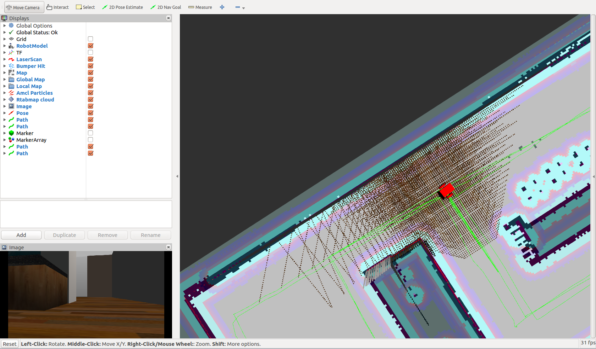

# ROS Simultaneous localisation and mapping (SLAM)

This repository contains a Robot Operating System (ROS) SLAM implementation for uses with a graph-based slam, real-time appearance-based mapping, or RTAB-Map.



## Project website

This repository has an accompanying project page, contains the theory and details behind the code. It can be found [here](https://www.haidynmcleod.com/slam).

## Prerequisites

1. [Ubuntu](https://www.ubuntu.com/) OS or [debian](https://www.debian.org/distrib/)

2. Robot Operating System (ROS). Installation instructions can be found [here](http://wiki.ros.org/ROS/Installation).

3. Install [OpenCV](https://docs.opencv.org/trunk/d7/d9f/tutorial_linux_install.html).

4. Install [RTAB_Map](https://github.com/introlab/rtabmap_ros) for SLAM. It is recommended to build from source.

5. Install ROS nodes required for the local and global planners and motor control for the navigation stack.

```sh
$ sudo apt-get update
$ sudo apt-get install ros-kinetic-move-base ros-kinetic-eband-local-planner ros-kinetic-global-planner
```

## Installing

Clone this repository in your catkin workspace 'src/' folder.

```sh
$ cd ~/catkin_ws/src/
$ git clone https://github.com/Heych88/skid_steer_bot.git
```

Now install missing dependencies using rosdep install:
```sh
$ cd ~/catkin_ws
$ rosdep install --from-paths src --ignore-src --rosdistro=kinetic -y
```

Build the project:
```sh
$ cd ~/catkin_ws
$ catkin_make
```

If you haven’t already, the following line can be added to your .bashrc to auto-source all new terminals
```
source ~/catkin_ws/devel/setup.bash
```

## Run the mapping code

In a terminal window, type the following to launch the kitchen diner environment.
```sh
$ cd ~/catkin_ws
$ source devel/setup.bash
$ roslaunch slam_project world_kitchen.launch
```


For the office environment use;
```sh
$ roslaunch slam_project world_willowHQ.launch
```


For the playground environment use;
```sh
$ roslaunch slam_project world_playground.launch
```


In a new terminal, run the 'teleop.launch' file to control the robots movement.
```sh
$ cd ~/catkin_ws
$ source devel/setup.bash
$ roslaunch slam_project teleop.launch
```

#### Mapping new environments

If you wish to map an environment with a new database, run the following.

In a new terminal, run the 'mapping.launch' file to start SLAM.
```sh
$ cd ~/catkin_ws
$ source devel/setup.bash
$ roslaunch slam_project mapping.launch
```

Rviz will begin to map and you should arrive at a result similar to below for the kitchen environment.



#### Multi-session mapping old environments

If the environment was the last environment mapped or the correct database.db has been loaded and you wish to extend the map or use goal navigation, run;

In a new terminal, run the 'localisation.launch' file to extend the previous map with SLAM.
```sh
$ cd ~/catkin_ws
$ source devel/setup.bash
$ roslaunch slam_project localisation.launch
```

Rviz will begin to map and you should arrive at a result similar to the Rviz mapping image above.

Use the `teleop` terminal window to drive the robot around until it has localised. Once it is localised, Rviz will be similar to the below.



You can download pre-mapped databases for each environment from [here](https://drive.google.com/open?id=1N4_2hQNAKHkBCLbugkAoKEWO-hkwqobJ).

In a terminal window, copy the desired database into the `~/.ros` folder and rename it to `rtabmap.db`. For example;
```sh
$ sudo cp <Download database location>/kitchen_dinner.db ~/.ros/rtabmap.db
```

### View SLAM database

After mapping you can view the database in a terminal window with;
```sh
$ rtabmap-databaseViewer ~/.ros/rtabmap.db
```

## License

This project is licensed under the MIT License - see the [LICENSE.md](LICENSE.md) file for details.
